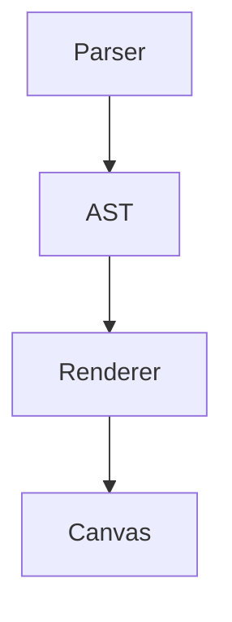

# (nf-fa-book) ASE Markdown Style Guide

> (nf-fa-tag) **Ase Docs** `00.16.32` [feat]

## (nf-fa-info_circle) Purpose and Scope

This document demonstrates **ALL** ASE Markdown features for compliance testing.

---

## Standard Elements

### Text Formatting

This is **bold**, *italic*, ~~strikethrough~~, and `inline code`.

### Lists

- Bullet item 1
- Bullet item 2
  - Nested bullet

1. Ordered item 1
2. Ordered item 2

### Links and Images

[ASE Documentation](https://docs.antarien.com)

### Tables

| Module | Layer | Status |
|--------|-------|--------|
| ase-terrain | L3 | core |
| ase-player | L3 | feat |
| ase-ecs | L1 | stable |

### Blockquotes

> The engine handles billions of entities in real-time.

---

## ASE Extensions

### Callouts

> [!INFO]
> The reference document is CAUSA_ASE_TIME.md.

> [!WARNING]
> Breaking changes in the next release.

> [!TIP]
> Use `ase mdv -B -R` to build and run the viewer.

> [!NOTE]
> This feature requires ase-markdown v0.1+.

### Math

The formula $h = g / sph$ calculates the hour.

$$
T_{eff} = T_0 \cdot \left(1 - \frac{v^2}{c^2}\right)^{1/2}
$$

### NerdFont Icons

## (nf-fa-cube) Architecture

### (nf-fa-cogs) Configuration

## Code Blocks

```cpp
struct PositionComponent {
    float x = 0.0f;
    float y = 0.0f;
    float z = 0.0f;
};
```

```typescript
@component
export class SkyBrightnessComponent {
    @field.float32 declare zenithBrightness: number;
}
```

```diff
+ Added new terrain system
- Removed legacy renderer
[v0.16.32] Release notes
-> Migration path documented
```



```svgbob
    +--------+     +--------+
    | Parser |---->|  AST   |
    +--------+     +--------+
```
