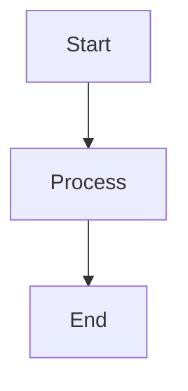

# (nf-fa-rocket) Full Demo Document

This demonstrates all ASE markdown features.

## Headings and Text

### Subsection H3
#### Subsection H4
##### Subsection H5
###### Subsection H6

Regular paragraph with **bold**, *italic*, `inline code`, and ~~strikethrough~~.

---

## Code Blocks

```cpp
#include <iostream>
int main() {
    std::cout << "Hello ASE" << std::endl;
    return 0;
}
```



```diff
- removed line
+ added line
  unchanged line
```

```svgbob
+---+    +---+
| A |--->| B |
+---+    +---+
```

## Math

Inline: $E = mc^2$ and $\alpha = 42$.

Display:

$$
\sum_{n=1}^{\infty} \frac{1}{n^2} = \frac{\pi^2}{6}
$$

## Callouts

> [!INFO]
> Information callout.

> [!WARNING]
> Warning callout.

> [!TIP]
> Tip callout.

> [!NOTE]
> Note callout.

## Tables

| Column A | Column B | Column C |
|----------|----------|----------|
| Cell 1   | Cell 2   | Cell 3   |
| Cell 4   | Cell 5   | Cell 6   |

## Lists

- Bullet item 1
- Bullet item 2
  - Nested item
- Bullet item 3

1. Ordered item 1
2. Ordered item 2
3. Ordered item 3

> This is a regular blockquote.

---

## Icons

This has a (nf-fa-rocket) icon and a (nf-fa-code) icon.

---

End of demo.
